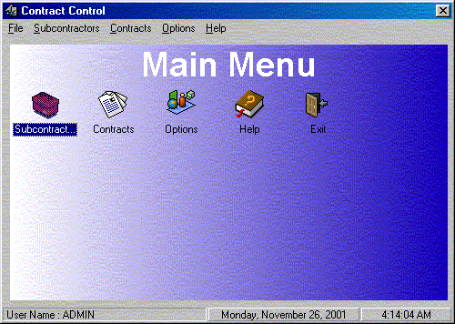



## ContractControl

### Description

This app is to help user to manage both his subcontractors and his contracts and to enable the user to see if a contract is making money or not. Database functions includes : Compact and Repair Database, Also enables user to backup and restore his database. Also includes login for users (Single Level)

Please vote for app
 
### More Info
 

             |
---                |---
**Submitted On**   |2001-11-26 04:05:32
**By**             |[Tertius Klopper](https://github.com/Planet-Source-Code/PSCIndex/blob/master/ByAuthor/tertius-klopper.md)
**Level**          |Intermediate
**User Rating**    |4.8 (43 globes from 9 users)
**Compatibility**  |VB 6\.0
**Category**       |[Complete Applications](https://github.com/Planet-Source-Code/PSCIndex/blob/master/ByCategory/complete-applications__1-27.md)
**World**          |[Visual Basic](https://github.com/Planet-Source-Code/PSCIndex/blob/master/ByWorld/visual-basic.md)
**Archive File**   |[ContractCo4240812152001\.zip](https://github.com/Planet-Source-Code/tertius-klopper-contractcontrol__1-29835/archive/master.zip)

